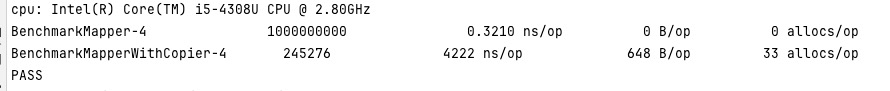

项目分层分为controller、domain、repository层，后期会加入service层，数据模型在层之间转换流转，
数据模型的转换存在于代码里的角角落落，在日常开发中可以说每时每刻都能遇到，
我们从最常见的两种业务需求：列表、详情功能来演示模型的转换过程。

```go
func (ctr *Article) Get(c *gin.Context) (response.Data, error) {

	request := new(request.ArticleGet)
	if err := c.Validate(request); err != nil {
		return nil, err
	}

	article := ctr.repo.Get(c.Request.Context(), request.ID)

	resp := new(response.ArticleGet)
	return resp.Mapper(article), nil
}

func (ctr *Article) All(c *gin.Context) (response.Data, error) {

	articles := ctr.repo.Find(c.Request.Context())

	resp := response.ArticleAll{}
	return resp.Mapper(articles), nil
}
```
[源码链接](https://github.com/wizardshan/elegantGo/tree/main/app/chapter4.0)

文章详情接口：<br>
request.ArticleGet：负责接受用户数据和数据校验。<br>
entity.Article: 负责数据查询和储存。<br>
domain.Article: 负责业务逻辑。<br>
response.ArticleGet: 负责数据展示和输出。<br>
request.ArticleGet => entity.Article => domain.Article => response.ArticleGet形成了完整的闭环。

#### 四种模型的变与不变
request模型：负责接受外部数据，用户的需求会不断的变化，导致request模型也在不断变化，所以需要单独新建模型应对这种变化。<br>
response模型：负责对外输出对用户展示的数据，同理request模型，对用户展示的需求也会不断变化，所以需要单独新建模型。<br>
entity模型：基于数据库，数据只有单条和多条形式的存在形式，所以entity模型是不变的。<br>
domain模型：基于entity模型转换，所以domain模型也是不变的。

>本文的关注点在于模型转换的代码执行效率和开发效率。
```go
func (entArticle *Article) Mapper() *domain.Article {
    if entArticle == nil {
        return nil
    }

    domArticle := new(domain.Article)
    domArticle.ID = entArticle.ID
    domArticle.Title = entArticle.Title
    domArticle.Content = entArticle.Content
    domArticle.TimesOfRead = entArticle.TimesOfRead
    domArticle.CreateTime = entArticle.CreateTime
    
    return domArticle
}
```
这是entity模型转换domain模型的Mapper函数，这种方式存在一个开发效率问题，
当模型属性多达十几二十个的时候，手动一对一属性赋值就很浪费时间，聪明的读者肯定第一时间会想到“反射”来解决这个问题。
```go
func (entArticle *Article) MapperWithCopier() *domain.Article {
        if entArticle == nil {
        return nil
    }
    domArticle := new(domain.Article)
    copier.Copy(entArticle, domArticle) // copier开源模型映射库

    return domArticle
}
```
采用反射的方式很方便很简洁，在大多数语言中也经常使用，例如java的BeanUtils.copyProperties，
但是众所周知反射效率很低，这种方式又存在代码执行效率的问题。


通过对比发现，反射跟一对一赋值的效率差了几个数量级，当然在中小型的公司服务器压力不大，反射就是开发效率很高的模型映射策略；
但是当我们霸道总裁上身，既要又要，既要开发效率又要代码执行效率的时候有什么好的方式呢？

解决方案就是通过工具自动生成一对一属性赋值的mapper函数，开发效率问题和代码执行效率同时兼顾，例如java的MapStruct库。

genstruct.go文件原理是通过反射entity模型获取到属性列表，自动生成entity mapper函数、domain模型、response模型和mapper函数。
只要手动新建一个entity模型，就可以自动生成对应分层中的模型，后续属性字段的增删改在此基础上操作就行。
```go
// 这里是原始的entity模型
type Items []*Item

type Item struct {
    ID         int
    Title      string
    CreateTime time.Time
    DeleteTime *time.Time
}

// 这里是自动生成的entity模型mapper函数
func (entItem *Item) Mapper() *domain.Item {
    if entItem == nil {
        return nil
    }

    domItem := new(domain.Item)
    domItem.ID = entItem.ID
    domItem.Title = entItem.Title
    domItem.CreateTime = entItem.CreateTime
    domItem.DeleteTime = entItem.DeleteTime

    return domItem
}

func (entItems Items) Mapper() domain.Items {

    size := len(entItems)
    domItems := make(domain.Items, size)
    
    for i := 0; i < size; i++ {
        domItems[i] = entItems[i].Mapper()
    }
    
    return domItems
}

// 这里是自动生成的domain模型
type Articles []*Article

type Article struct {
    ID          int
    Title       string
    Content     string
    TimesOfRead int
    CreateTime  time.Time
}

// 这里是自动生成的response模型和mapper函数
type Items []*Item

type Item struct {
    ID         int        `json:"id"`
    Title      string     `json:"title"`
    CreateTime time.Time  `json:"createTime"`
    DeleteTime *time.Time `json:"deleteTime"`
}

func (respItem *Item) Mapper(domItem *domain.Item) *Item {
    if domItem == nil {
        return nil
    }
    respItem.ID = domItem.ID
    respItem.Title = domItem.Title
    respItem.CreateTime = domItem.CreateTime
    respItem.DeleteTime = domItem.DeleteTime
    return respItem
}

func (respItems Items) Mapper(domItems domain.Items) Items {

    size := len(domItems)
    respItems = make(Items, size)
    for i := 0; i < size; i++ {
        var respItem Item
	    respItems[i] = respItem.Mapper(domItems[i])
    }
    
    return respItems
}
```
自动生成代码除了反射的方式，还有可以通过分析文件代码结构的方式来实现，不过比较繁琐，有兴趣可以试试。

>日常开发中的重复工作大部分都有规律可循，可以通过第三方工具或者实现适合自己需求的工具来提高开发效率。
