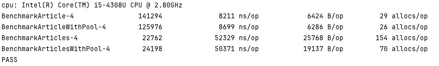

实验性课题：实例模型使用pool池代替new函数（domain）
```go
var itemPool = pool.New(func() *domain.Article {
    return new(domain.Article)
})

func (entArticle *Article) MapperWithPool() *domain.Article {
    if entArticle == nil {
        return nil
    }

    domArticle := itemPool.Get()
    domArticle.ID = entArticle.ID
    domArticle.Title = entArticle.Title
    domArticle.Content = entArticle.Content
    domArticle.TimesOfRead = entArticle.TimesOfRead
    domArticle.CreateTime = entArticle.CreateTime

    return domArticle
}
```


理论推测：性能肯定没有new函数效率高，snyc.Pool有装箱/拆箱操作，但是重用对象可以减轻GC的压力
