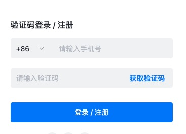

web开发中，你肯定见到过各种各样的表单或接口数据校验：
- 客户端参数校验：在数据提交到服务器之前，发生在浏览器端或者app应用端，相比服务器端校验，用户体验更好，能实时反馈用户的输入校验结果。

- 服务器端参数校验：发生在客户端提交数据并被服务器端程序接收之后，通常服务器端校验都是发生在将数据写入数据库之前，如果数据没通过校验，则会直接从服务器端返回错误消息，并且告诉客户端发生错误的具体位置和原因，服务器端校验不像客户端校验那样有好的用户体验，因为它直到整个表单都提交后才能返回错误信息。但是服务器端校验是应用对抗错误，恶意数据的最后防线，在这之后，数据将被持久化至数据库。当今所有的服务端框架都提供了数据校验与过滤功能（让数据更安全）。

本文主要讨论服务器端参数校验。

确保用户以正确格式输入数据，提交的数据能使后端应用程序正常工作，同时在一切用户的输入都是不可信的前提下（SQL注入，XSS，CSRF等漏洞），
参数验证是不可或缺的一环，也是很繁琐效率不高的一环，在对接表单提交或者api接口数据提交，程序里充斥着大量重复验证逻辑和if else语句，本文分析参数校验的三种方式，找出最优解，从而提高参数验证程序代码的开发效率。



#### 案例：
如上图为常见的网站登陆场景，用户第一步输入手机号，点击获取短信验证码；
第二步填入手机收到的短信验证码，点击登录按钮完成登录。<br>
需要实现两个接口：
```
发送验证码接口：
参数校验需求：判断手机号非空，手机号格式是否正确
登录接口：
参数校验需求：1、判断手机号非空，手机号格式是否正确；2、验证码非空，验证码格式是否正确
```
#### 项目技术介绍
1、使用了工作区模式管理多模块，关于工作区的知识点请读者自行学习；<br>
2、web框架选用了[gin](https://github.com/gin-gonic/gin)；<br>
3、目前简单封装了gin框架，自定义Handler.Wrapper函数统一了输出数据结构；<br>
4、gin源码中增加ParamError参数错误结构体；<br>
>修改第三方库源码要有信心，不要畏惧，为了适合项目使用的便利性，本系列会多次修改第三库源代码。