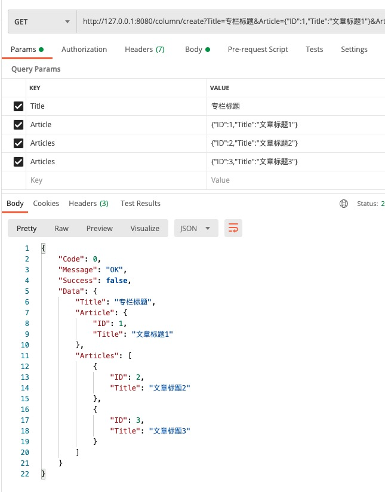

web开发中，你肯定见到过各种各样的表单或接口数据校验：
- 客户端参数校验：在数据提交到服务器之前，发生在浏览器端或者app应用端，相比服务器端校验，用户体验更好，能实时反馈用户的输入校验结果。

- 服务器端参数校验：发生在客户端提交数据并被服务器端程序接收之后，通常服务器端校验都是发生在将数据写入数据库之前，如果数据没通过校验，则会直接从服务器端返回错误消息，并且告诉客户端发生错误的具体位置和原因，服务器端校验不像客户端校验那样有好的用户体验，因为它直到整个表单都提交后才能返回错误信息。但是服务器端校验是应用对抗错误，恶意数据的最后防线，在这之后，数据将被持久化至数据库。当今所有的服务端框架都提供了数据校验与过滤功能（让数据更安全）。

本文主要讨论服务器端参数校验。

确保用户以正确格式输入数据，提交的数据能使后端应用程序正常工作，同时在一切用户的输入都是不可信的前提下（SQL注入，XSS，CSRF等漏洞），
参数验证是不可或缺的一环，也是很繁琐效率不高的一环，在对接表单提交或者api接口数据提交，程序里充斥着大量重复验证逻辑和if return语句，本文分析参数校验的三种方式，找出最优解，从而提高参数验证程序代码的开发效率。


#### 案例：
如上图为常见的网站登陆场景，用户第一步输入手机号，点击获取短信验证码；
第二步填入手机收到的短信验证码，点击登录按钮完成登录。<br>
需要实现两个接口：
```
发送验证码接口：
参数校验需求：判断手机号非空，手机号格式是否正确
登录接口：
参数校验需求：1、判断手机号非空，手机号格式是否正确；2、验证码非空，验证码格式是否正确
```
#### 项目技术介绍
1、使用了工作区模式管理多模块，关于工作区的知识点请读者自行学习；<br>
2、web框架选用了[gin](https://github.com/gin-gonic/gin)；<br>
3、目前简单封装了gin框架，自定义Handler.Wrapper函数统一了输出数据结构；<br>
4、gin源码中增加ParamError参数错误结构体；<br>
>修改第三方库源码要有信心，不要畏惧，为了适合项目使用的便利性，本系列会多次修改第三库源代码。

#### 第一种实现方式：自定义实现校验逻辑
```go
// controller.Captcha
func (ctr *Captcha) Send(c *gin.Context) (response.Data, error) {
    mobile := c.DefaultPostForm("mobile", "")

    if mobile == "" {
        return nil, gin.NewParamError("手机号不能为空")
    }

    matched, err := regexp.MatchString(`^(1[3-9][0-9]\d{8})$`, mobile)
    if err != nil {
        return nil, err
    }

    if !matched {
        return nil, gin.NewParamError("手机号格式不正确")
    }

    return nil, nil
}

// controller.User
func (ctr *User) Login(c *gin.Context) (response.Data, error) {
    mobile := c.DefaultPostForm("mobile", "")
    captcha := c.DefaultPostForm("captcha", "")

    if mobile == "" {
        return nil, gin.NewParamError("手机号不能为空")
    }

    matched, err := regexp.MatchString(`^(1[3-9][0-9]\d{8})$`, mobile)
    if err != nil {
        return nil, err
    }

    if !matched {
        return nil, gin.NewParamError("手机号格式不正确")
    }

    if captcha == "" {
        return nil, gin.NewParamError("验证码不能为空")
    }

    if len(captcha) != 4 {
        return nil, gin.NewParamError("验证码非法")
    }

    return nil, nil
}
```
[源码链接](https://github.com/wizardshan/elegantGo/tree/main/app/chapter1.0)

代码分析：<br>
参数验证函数放在Controller层；<br>
这是一种比较朴素的实现方式，在现实代码评审中经常遇到，这样实现会有什么问题？<br>
1、手机号码验证逻辑重复；<br>
2、违背了controller层的职责，controller层充斥着大量的验证函数（Controller层职责：从HTTP请求中获得信息，提取参数，并分发给不同的处理服务），这很不优雅；

> **重复代码是软件质量下降的最重要的原因！！！**

1、重复代码会造成维护成本的成倍增加；<br>
2、需求的变动导致需要修改重复代码，如果遗漏某处重复的逻辑，就会产生bug（例如手机号码增加12开头的验证规则）；<br>
3、重复代码会导致项目代码体积变得臃肿；

聪明的开发者肯定第一时间想到解决办法：提取出验证逻辑，工具包util实现IsMobile函数
```
package util

func IsMobile(mobile string) bool {
   matched, _ := regexp.MatchString(`^(1[3-9][0-9]\d{8})$`, mobile)
   return matched
}

代码分析：
问题：代码会大量出现util.IsMobile、util.IsEmail等校验代码
```
> 思考：从面向对象的思想出发，IsMobile属于util的动作或行为吗？（先思考，后文会详细探讨）

#### 第二种实现方式：模型绑定校验
> 技术选型：web框架gin自带的模型验证器中文提示不灵活，这里使用[govalidator](https://github.com/asaskevich/govalidator)

模型绑定校验是目前参数校验最主流的验证方式，每个编程语言的web框架基本都支持这种模式，模型绑定时将Http请求中的数据映射到模型对应的参数，参数可以是简单类型，如整形，字符串等，也可以是复杂类型，如Json，Json数组，对各种数据类型进行验证，然后抛出相应的错误信息。
```go
// request.CaptchaSend
type CaptchaSend struct {
    Mobile string `form:"mobile" valid:"required~手机号不能为空,numeric~手机号码应该为数字型,IsMobile~手机号码格式错误"`
}

// request.UserLogin
type UserLogin struct {
    Mobile string `form:"mobile" valid:"required~手机号不能为空,numeric~手机号码应该为数字型,IsMobile~手机号码格式错误"`
    Captcha string `form:"captcha" valid:"required~验证码不能为空,numeric~验证码应该为数字型"`
}

// controller.Captcha
func (ctr *Captcha) Send(c *gin.Context) (response.Data, error) {

    request := new(request.CaptchaSend)
    if err := c.ShouldBind(request); err != nil {
        return nil, gin.NewParamError(err.Error())
    }

    if _, err := govalidator.ValidateStruct(request); err != nil {
        return nil, gin.NewParamError(err.Error())
    }

    return nil, nil
}

// controller.User
func (ctr *User) Login(c *gin.Context) (response.Data, error) {
    request := new(request.UserLogin)
    if err := c.ShouldBind(request); err != nil {
        return nil, gin.NewParamError(err.Error())
    }

    if _, err := govalidator.ValidateStruct(request); err != nil {
        return nil, gin.NewParamError(err.Error())
    }

    return nil, nil
}
```
代码分析：
mobile校验逻辑同样重复（如错误提示"手机号不能为空"修改为"请填写手机号"，需要修改两个地方）
[源码链接](https://github.com/wizardshan/elegantGo/tree/main/app/chapter1.1)

再介绍第三种参数校验方式之前，先审视一下刚才的一段代码：
```go
    if err := c.ShouldBind(request); err != nil {
        return nil, gin.NewParamError(err.Error())
    }

    if _, err := govalidator.ValidateStruct(request); err != nil {
        return nil, gin.NewParamError(err.Error())
    }
```
参数绑定校验的地方都需要出现这几行结构重复的代码，这很不优雅，可以通过修改gin源码，消除这几行重复代码;

```go
// gin_plus.go文件增加Validate方法
func (c *Context) Validate(data interface{}) error {

    if err := c.ShouldBind(data); err != nil {
        return NewParamError(err.Error())
    }

    if _, err := govalidator.ValidateStruct(data); err != nil {
        return NewParamError(err.Error())
    }

    return nil
}

// controller.Captcha
func (ctr *Captcha) Send(c *gin.Context) (response.Data, error) {

    request := new(request.CaptchaSend)
	if err := c.Validate(request); err != nil {
        return nil, err
    }

    return nil, nil
}

// controller.User
func (ctr *User) Login(c *gin.Context) (response.Data, error) {
    request := new(request.UserLogin)
	if err := c.Validate(request); err != nil {
        return nil, err
    }

    return nil, nil
}
```
[源码链接](https://github.com/wizardshan/elegantGo/tree/main/app/chapter1.2)

模型校验是通过反射机制来实现，反射的效率都不高，现在实现了gin框架集成govalidator，gin原有的校验功能就显得多余，小伙伴们可以从ShouldBind函数从下追，把自带的校验功能屏蔽，提高框架效率。

#### 第三种实现方式：拆解模型字段，组合结构体
解决字段校验逻辑重复是拆解字段为独立结构体，通过多个字段结构体的不同组合为所需的校验结构体；
```
type MobileField struct {
    Mobile string `form:"mobile" valid:"required~手机号不能为空,numeric~手机号码应该为数字型,stringlength(11|11)~手机号码长度错误,mobile~手机号码格式错误"`
}

type CaptchaField struct {
    Captcha string `form:"captcha" valid:"required~验证码不能为空,numeric~验证码应该为数字型,stringlength(4|4)~验证码长度错误"`
}

type CaptchaSend struct {
    MobileField
}

type UserLogin struct {
    MobileField
    CaptchaField
}

type UserRegister struct {
    MobileField
    CaptchaField
    user.PasswordField
    user.RePasswordField
    user.NicknameField
}
```
代码分析：
1、独立的字段结构体通常以表名为包名定义范围，比如商品名称和用户名称字段名都为Name，但是所需定义的校验逻辑（字符长度等）很有可能不同；<br>
2、复用例如Mobile、Captcha、ID、CreateTime等公共字段结构体；<br>
[源码链接](https://github.com/wizardshan/elegantGo/tree/main/app/chapter1.3)

#### 对于复杂场景下的参数校验解决方案
需求场景：用户注册时，需要对密码和重复密码字段校验是否相等；
```go
// gin_plus.go文件增加Validator接口
type Validator interface {
    Validate() error
}

func (c *Context) Validate(data interface{}) error {

	if err := c.ShouldBind(data); err != nil {
		return NewParamError(err.Error())
	}

	if _, err := govalidator.ValidateStruct(data); err != nil {
		return NewParamError(err.Error())
	}
    // Validator接口判断
	if v, ok := data.(Validator); ok {
		if err := v.Validate(); err != nil {
			return NewParamError(err.Error())
		}
	}

	return nil
}

// request.UserRegister结构体实现Validator接口
type UserRegister struct {
    MobileField
    CaptchaField
    user.PasswordField
    user.RePasswordField
    user.NicknameField
}

func (req *UserRegister) Validate() error {
    if req.Password != req.RePassword {
        return errors.New("两次密码不一致")
    }

    return nil
}
```
[源码链接](https://github.com/wizardshan/elegantGo/tree/main/app/chapter1.4)

总结：<br>
一、验证逻辑封装在各自的实体中，由request层实体负责验证逻辑，验证逻辑不会散落在项目代码的各个地方，当验证逻辑改变时，修改对应的实体就可以了，这就是代码的高内聚；

二、通过不同实体的嵌套组合就可以实现多样的验证需求，提高了代码的复用率，这就是代码的可重用性

独立字段结构体组合成不同的校验结构体，这种方式在实际项目开发中有很大的灵活性，可以满足参数校验比较多变复杂的需求场景，小伙伴可以在项目开发中慢慢体会。

#### 几个注意事项
1、需要提交参数为json或json数组如何校验绑定？参照下图接口代码<br>


2、严格遵循一个接口对应一个校验结构体
```go
func (ctr *Column) Detail(c *gin.Context) {
    request := new(request.IDField)
    if err := c.Validate(request); err != nil {
        return nil, err
    }

    return request, nil
}
```
示例代码获取文章专栏详情的接口，参数为专栏id，因为只有一个id参数，
如果刚开始图省事，没有建立对应独立的ColumnDetail校验结构体，后期接口增加参数（例如来源等），还是要改动这一块代码，增加代码的不确定性

3、布尔参数的三种状态
```go
type ColumnDetail struct {
    IDField
    // 为真显示重点文章，为否显示非重点文章，为nil都显示
    ArticleIsImportant *bool `form:"articleIsImportant"`
}

column?id=1&articleIsImportant=true    ArticleIsImportant为true
column?id=1&articleIsImportant=false   ArticleIsImportant为false
column?id=1                            ArticleIsImportant为nil
```


[源码链接](https://github.com/wizardshan/elegantGo/tree/main/app/chapter1.4)