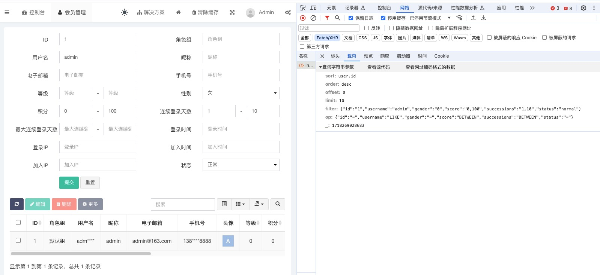

上图为php语言的后台管理系统[fastAdmin](https://www.fastadmin.net/)，展示的是用户列表菜单，集成了功能强大的参数查询，日常开发中也经常需要实现这种较为复杂的查询业务，我们先对参数功能进行归纳分类：
```
公共字段：
Sort：  排序字段，可以不传，不传服务器默认值为`id`，默认按数据库自增id字段排序
Order： 排列规则字段，具有两个值`ASC`和`DESC`，可以不传，不传服务器默认值为`DESC`，默认降序，展示数据库最新的数据
Offset：偏移量字段，最小为0，可以不传，不传服务器默认值为0
Limit： 行数字段，最小为1，最大1000，可以不传，不传服务器默认值为100

过滤字段Filter：
等于过滤：例如id=5
Like过滤：例如昵称包含某个值
范围过滤：例如创建时间或用户余额在某一个范围，支持`>= && <=`、`>=`、`<=`三种类型，格式如`2024-01-01,2024-07-01"`、`10,100`、`,100`、`10,`
枚举过滤：例如用户状态为：正常、注销、无效三种状态过滤，格式如`normal,cancel,invalid`、`10,20,30,40,50`
```
我们由简入繁，先实现公共字段：
```go
type QueryField struct {
    Sort   *SortField   `binding:"omitempty,alphanum"`
    Order  *OrderField  `binding:"omitempty,oneof=DESC ASC"`
    Offset *OffsetField `binding:"omitempty,number,min=0"`
    Limit  *LimitField  `binding:"omitempty,number,min=1,max=1000"`
}

type SortFieldV1 string

func (req *SortFieldV1) Value() string {
    if req == nil {
        return "id"
    }
    
    return stringy.New(string(*req)).SnakeCase().ToLower() // 配合entGo框架，传入CreateTime转化为create_time，ID转化为id
}
```
[源码链接](https://github.com/wizardshan/elegantGo/tree/main/app/chapter-param-complex-validator-1)
代码分析：<br>
1、Sort、Order、Offset、Limit参数默认可以不传，所以需要使用指针，当参数没有传的时候进行nil判断，返回默认值<br>
2、SortFieldV1中的字符串"id"、OrderFieldV1中的字符串"DESC"、OffsetFieldV1中的数字0、、LimitFieldV1中的数字100是魔法值，需要消除<br>

**魔法值**<br>
魔法值，通常是指在代码编写时莫名出现的数字或字符串，无法直接判断其代表的含义，必须通过联系代码上下文分析才可以明白，严重降低了代码的可读性。

我们使用函数名自解释的方式来消除魔法值，defaultValue方法名称明确解释了字符串"id"是SortField的默认值。同理OrderField、OffsetField、LimitField。
```go
type SortField string

func (req *SortField) Value() string {
    if req == nil {
        return req.defaultValue()
    }
    
    return stringy.New(string(*req)).SnakeCase().ToLower()
}

func (req *SortField) defaultValue() string {
    return "id"
}

```

然后再看过滤参数Filter：
```go
type UserMany struct {
    QueryField
    
    Filter struct {
        ID         *int    `binding:"omitempty,min=1"`
        Nickname   *string `binding:"omitempty,min=2"`
        CreateTime DateTimeRangeFieldV1
    }
}
```
代码分析：<br>
等于过滤、Like过滤很简单，通过指针nil判断在代码中决定使不使用此参数

我们重点分析CreateTime时间范围过滤的实现过程，目前是V1版本，需要支持如`2024-01-01 00:00:00`年月日时分秒的时间格式
```go
type DateTimeRangeFieldV1 struct {
    Start time.Time
    End   time.Time
}

func (req *DateTimeRangeFieldV1) UnmarshalJSON(b []byte) error {

    // 解析json字符串
    var data string
    if err := json.Unmarshal(b, &data); err != nil {
        return err
    }

    // 校验字符串有效性
    if find := strings.Contains(data, ","); !find {
        return errors.New("parameter should be separated by commas")
    }

    // 解析字符串为range数组并检验range数组有效性
    elements := strings.Split(data, ",")
    capacity := len(elements)
    if capacity != 2 {
        return errors.New(fmt.Sprintf("the rangeField capacity expected value is 2, the result is %d", capacity))
    }

    // 解析range数组中的开始时间和结束时间
    startStr := elements[0]
    endStr := elements[1]
    
    var err error
    if startStr != "" {
        req.Start, err = time.Parse(time.DateTime, startStr)
        if err != nil {
            return errors.New(fmt.Sprintf(fmt.Sprintf("the time layout should be `%s`", time.DateTime)))
        }
    }

    if endStr != "" {
        req.End, err = time.Parse(time.DateTime, endStr)
        if err != nil {
            return errors.New(fmt.Sprintf(fmt.Sprintf("the time layout should be `%s`", time.DateTime)))
        }
    }
    
    // 检验开始时间和结束时间的逻辑有效性
    if !req.Start.IsZero() && !req.End.IsZero() && req.Start.After(req.End) {
        return errors.New("the rangeField start must lt end")
    }

    return nil
}
```

DateTimeRangeFieldV1中的关键代码是UnmarshalJSON方法，我们从可读性和可维护性两方面来分析代码。<br>
**可读性：**<br>
当业务有所变动时，第一步是定位到需要变动的代码，如何UnmarshalJSON方法中定位到需要变动的代码，没有好的办法，只能通过通读整个方法的代码才能定位需要变动功能点的代码实现，UnmarshalJSON方法揉杂了数据的格式化、有效性校验、数据转化、业务逻辑判断等多种意图的代码，当阅读代码行数的不断增加，老变量的作用需要我们记忆，不断出现的新变量需要我们理解，新老变量的交替出现让我们的思维一直跳跃，这还只是几十行代码，如果几百上千行代码，最终我们的脑袋乱成了一锅粥，直到崩溃边缘，这就是**可读性差**。

>读与写花费时间的比例超过10:1。写新代码时，我们一直在读旧代码。既然比例如此之高，我们就想让读的过程变得轻松，即便那会使得编写过程更难。没可能光写不读，所以使之易读实际也使之易写。
这事概无例外，不读周边代码的话就没法写代码。编写代码的难度，取决于读周边代码的难度。要想干得快，要想早点做完，要想轻松写代码，先让代码易读吧。--摘自<<代码整洁之道>>

> 有研究表明，我们大多数人同时只能考虑3~4件“事情” --摘自<<编写可读代码的艺术>>

**可维护性：**<br>
当出现bug时，例如日志记录记录多少行报错，修复bug的第一步是先通过日志找到报错代码，第二步是理解报错代码所在的上下文，UnmarshalJSON里的上下文就是整个方法的代码，我们还是只能通过通读整个方法，理解上下文的意图，才能放心的修复bug，同上这个方法并不好理解，这就是**可维护性差**。

分治法是人类对于复杂问题的通用解决思想，分而治之就是把大问题合理划分为若干个子问题，如有需要子问题再合理划分为更小颗粒度的子问题，直到最后子问题可以简单的直接求解，大问题的解即子问题的解的合并。看似整个过程很简单，关键在于如何合理的划分，这就要不断的思考学习总结。
```go
type DateTimeRangeFieldV2 struct {
    Start time.Time
    End   time.Time
}

func (req *DateTimeRangeFieldV2) UnmarshalJSON(b []byte) error {

    data, err := req.unmarshal(b)
    if err != nil {
        return err
    }
    
    elements, err := req.split(data)
    if err != nil {
        return err
    }
    
    if err = req.parse(elements); err != nil {
        return err
    }

    if err = req.valid(); err != nil {
        return err
    }
    
    return nil
}

func (req *DateTimeRangeFieldV2) unmarshal(b []byte) (data string, err error) {
    // 解析json字符串
    if err = json.Unmarshal(b, &data); err != nil {
        return
    }
    
    // 校验字符串有效性
    if find := strings.Contains(data, ","); !find {
        err = errors.New("parameter should be separated by commas")
    }
    return
}

func (req *DateTimeRangeFieldV2) split(data string) (elements []string, err error) {
    // 解析字符串为range数组并检验range数组有效性
    elements = strings.Split(data, ",")
    capacity := len(elements)
    if capacity != 2 {
        err = errors.New(fmt.Sprintf("the rangeField capacity expected value is 2, the result is %d", capacity))
    }
    return
}

func (req *DateTimeRangeFieldV2) parse(elements []string) (err error) {
    // 解析range数组中的开始时间和结束时间
    startStr := elements[0]
    endStr := elements[1]
    
    if startStr != "" {
        req.Start, err = time.Parse(time.DateTime, startStr)
        if err != nil {
            return errors.New(fmt.Sprintf(fmt.Sprintf("the time layout should be `%s`", time.DateTime)))
        }
    }
    
    if endStr != "" {
        req.End, err = time.Parse(time.DateTime, endStr)
        if err != nil {
            return errors.New(fmt.Sprintf(fmt.Sprintf("the time layout should be `%s`", time.DateTime)))
        }
    }
    
    return
}

func (req *DateTimeRangeFieldV2) valid() error {
    // 检验开始时间和结束时间的逻辑有效性
    if !req.Start.IsZero() && !req.End.IsZero() && req.Start.After(req.End) {
        return errors.New("the rangeField start must lt end")
    }
    return nil
}
```
依照分治思想，按功能点我们把UnmarshalJSON方法拆出四个小方法：<br>
unmarshal：解析json字符串<br>
split：json字符串解析字符串数组<br>
parse：解析字符串数组到业务数据Start、End时间变量<br>
valid：校验Start、End时间变量逻辑有效性

**可读性：**<br>
定位到需要变动的代码时，我们只要按功能点找到四个小方法中其中的一个，然后通读这个小方法，小方法代码较少，可以快速理解消化代码意图，这样就大大提高了开发效率。

**可维护性：**<br>
当出现bug需要理解bug所在代码的上下文时，这时的上下文就局限在这四个小方法里，同上，快速理解快速修复。


现实生活中我们见过左图的台阶，又陡又长，让人望而生畏，担心脚底一打滑骨碌碌滚下去怎么办；当我们面对一个函数或方法包含几十行甚至几百上千行代码时，如同面对又陡又长的台阶，内心的状态是焦虑不安不自信，生怕某一处的代码没有理解或者逻辑有遗漏导致出现bug。

当然也有右图的台阶，虽然同样又陡又长，但每隔一定距离会设置一个小平台，把整个台阶分割成若干个小台阶，小平台可以让人休憩一会，平复一下心态；当大方法拆成多个小方法，小方法如同小台阶，当阅读代码时，理解完一个小方法相当于达成一个小目标，然后可以平复一下心态，继续理解下一个小方法。


