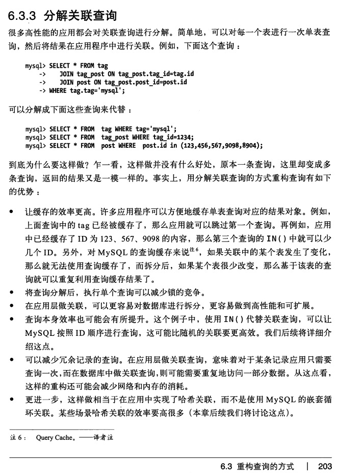

### entGo框架实现ORM
上文说到手写SQL实现ORM框架所需的代码量是联表方式的两倍或更多，并且实现过程都是大同小异，属于代码开发中的搬砖活，为了提高效率我们引入entGo框架来解决重复工作的低效问题。

entGo详细教程请参照官网，有中文文档：https://entgo.io/

使用entGo实现上文中的三个接口：
```go
// 帖子列表
func (repo *Post) FetchMany(ctx context.Context) []*ent.Post {
    return repo.db.Post.Query().WithUser().Order(ent.Desc(post.FieldCreateTime)).AllX(ctx)
}

http://127.0.0.1:8080/posts
[
  {
    "id": 1,
    "create_time": "2024-08-01T00:00:00Z",
    "update_time": "2024-08-02T00:00:00Z",
    "hash_id": "oKqk6tMl7z",
    "user_id": 1,
    "title": "标题1",
    "content": "内容1",
    "views": 100,
    "edges": {
      "user": {
        "id": 1,
        "create_time": "2024-08-01T00:00:00Z",
        "update_time": "2024-08-02T00:00:00Z",
        "level": 10,
        "nickname": "昵称1",
        "avatar": "头像1.png",
        "edges": {}
      }
    }
  },
  {
    "id": 2,
    "create_time": "2024-08-01T00:00:00Z",
    "update_time": "2024-08-02T00:00:00Z",
    "hash_id": "02qN7SQyOb",
    "user_id": 2,
    "title": "标题2",
    "content": "内容2",
    "views": 200,
    "edges": {
      "user": {
        "id": 2,
        "create_time": "2024-08-01T00:00:00Z",
        "update_time": "2024-08-02T00:00:00Z",
        "level": 20,
        "nickname": "昵称2",
        "avatar": "头像2.png",
        "edges": {}
      }
    }
  }
]

// 帖子详情
func (repo *Post) Fetch(ctx context.Context, id int) *ent.Post {
    return repo.db.Post.Query().WithUser().WithComments(func(ops *ent.CommentQuery) {
        ops.WithUser()
    }).Where(post.ID(id)).FirstX(ctx)
}
            
http://127.0.0.1:8080/post   
{
  "id": 1,
  "create_time": "2024-08-01T00:00:00Z",
  "update_time": "2024-08-02T00:00:00Z",
  "hash_id": "oKqk6tMl7z",
  "user_id": 1,
  "title": "标题1",
  "content": "内容1",
  "views": 100,
  "edges": {
    "comments": [
      {
        "id": 1,
        "create_time": "2024-08-01T00:00:00Z",
        "update_time": "2024-08-02T00:00:00Z",
        "user_id": 1,
        "post_id": 1,
        "content": "评论1",
        "edges": {
          "user": {
            "id": 1,
            "create_time": "2024-08-01T00:00:00Z",
            "update_time": "2024-08-02T00:00:00Z",
            "level": 10,
            "nickname": "昵称1",
            "avatar": "头像1.png",
            "edges": {}
          }
        }
      }
    ],
    "user": {
      "id": 1,
      "create_time": "2024-08-01T00:00:00Z",
      "update_time": "2024-08-02T00:00:00Z",
      "level": 10,
      "nickname": "昵称1",
      "avatar": "头像1.png",
      "edges": {}
    }
  }
}

// 最新评论
func (repo *Post) Comments(ctx context.Context) []*ent.Comment {
    return repo.db.Comment.Query().WithUser().WithPost().Order(ent.Desc(comment.FieldCreateTime)).AllX(ctx)
}
        
http://127.0.0.1:8080/post/comments
[
  {
    "id": 1,
    "create_time": "2024-08-01T00:00:00Z",
    "update_time": "2024-08-02T00:00:00Z",
    "user_id": 1,
    "post_id": 1,
    "content": "评论1",
    "edges": {
      "post": {
        "id": 1,
        "create_time": "2024-08-01T00:00:00Z",
        "update_time": "2024-08-02T00:00:00Z",
        "hash_id": "oKqk6tMl7z",
        "user_id": 1,
        "title": "标题1",
        "content": "内容1",
        "views": 100,
        "edges": {}
      },
      "user": {
        "id": 1,
        "create_time": "2024-08-01T00:00:00Z",
        "update_time": "2024-08-02T00:00:00Z",
        "level": 10,
        "nickname": "昵称1",
        "avatar": "头像1.png",
        "edges": {}
      }
    }
  },
  {
    "id": 2,
    "create_time": "2024-08-01T00:00:00Z",
    "update_time": "2024-08-02T00:00:00Z",
    "user_id": 2,
    "post_id": 2,
    "content": "评论2",
    "edges": {
      "post": {
        "id": 2,
        "create_time": "2024-08-01T00:00:00Z",
        "update_time": "2024-08-02T00:00:00Z",
        "hash_id": "02qN7SQyOb",
        "user_id": 2,
        "title": "标题2",
        "content": "内容2",
        "views": 200,
        "edges": {}
      },
      "user": {
        "id": 2,
        "create_time": "2024-08-01T00:00:00Z",
        "update_time": "2024-08-02T00:00:00Z",
        "level": 20,
        "nickname": "昵称2",
        "avatar": "头像2.png",
        "edges": {}
      }
    }
  }
]
```
[源码链接](https://github.com/wizardshan/elegantGo/tree/main/app/chapter-orm-entgo)

edges属性是entGo框架定义对象关系的边概念，后文会进行消除；如果我们忽略edges属性，是不是就跟前文中的json数据格式一致了。

可以看到我们只使用了1-3行就实现了前文中几十行代码的工作量，减少了手写SQL的机械单调的过程，大大提高了开发效率。

帖子列表通过debug打印entGo的SQL日志如下：
```sql
SELECT `posts`.`id`, `posts`.`create_time`, `posts`.`update_time`, `posts`.`hash_id`, `posts`.`user_id`, `posts`.`title`, `posts`.`content`, `posts`.`views` FROM `posts` ORDER BY `posts`.`create_time` DESC args=[]
SELECT `users`.`id`, `users`.`create_time`, `users`.`update_time`, `users`.`level`, `users`.`nickname`, `users`.`avatar` FROM `users` WHERE `users`.`id` IN (?, ?) args=[1 2]
```
对比我们自己手写的SQL一模一样，内部组装数据的步骤流程也是大同小异。

**代码符合ORM规范的优势**<br>
一、提高服务器开发效率，使用ORM框架不用手写效率低下SQL语句；<br>
二、提高接口对接效率，客户端模型与服务器模型一一对应，不同业务就是不同模型的组合；<br>
三、降低客户端与服务器端人员的沟通成本，都在相同的模型上讨论业务需求，不容易产生歧义；<br>
四、使用ORM框架，避免了关联查询，针对单表sql的慢查询优化比多表关联sql要简单；<br>
五、ORM框架都实现了SQL预编译，从而避免了SQL注入（后文详解）；<br>
六、避免关联查询会带来很多好处，参照<<高性能MySQL第3版 6.3.3章节：分解关联查询>>：


ORM带来的问题：<br>
问题1：ORM框架默认查询都会把所有字段查出来，也支持部分字段查询，需要手动指定具体字段名，但这样又降低了开发效率;<br>
例如不需要大字段的时候也被查出来，比如帖子列表接口，content字段为text类型，手写sql的可以不写content，但是ORM框架每次都是全部查出来；<br>
解决：增加postContents表，把content放在这张表中，通过post_id关联，需要content的时候再加载进来；<br>

问题2：统计业务怎么用ORM，统计业务主要是数据汇总、分类操作，可以用ORM框架实现也可以手写，看哪种方便；ORM说的是对象映射关系，跟统计业务关系不大；
