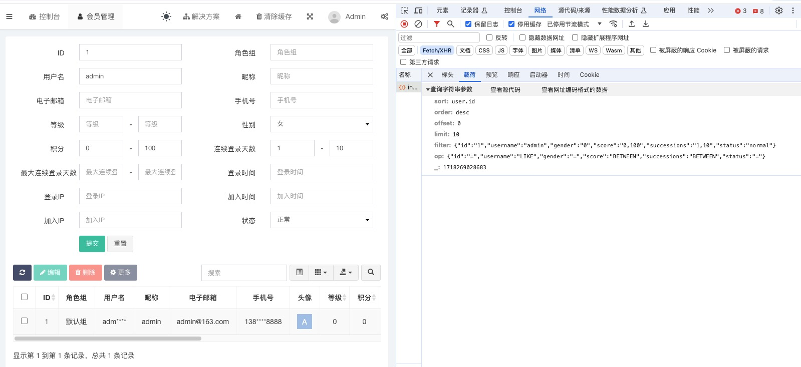

# 参数校验：抽象到具体的思维方式



上图为php语言的后台管理系统[fastAdmin](https://www.fastadmin.net/)，展示的是用户列表菜单，集成了功能强大的参数查询，日常开发中也经常需要实现这种较为复杂的查询业务，我们先对参数功能进行归纳分类：
```
公共字段：
Sort：  排序字段，可以不传，不传服务器默认值为`id`，默认按数据库自增id字段排序
Order： 排列规则字段，具有两个值`ASC`和`DESC`，可以不传，不传服务器默认值为`DESC`，默认降序，展示数据库最新的数据
Offset：偏移量字段，最小为0，可以不传，不传服务器默认值为0
Limit： 行数字段，最小为1，最大100，可以不传，不传服务器默认值为100

过滤字段：
等于过滤：例如id=5
Like过滤：例如昵称包含某个值
范围过滤：例如创建时间或用户余额在某一个范围，支持`>= && <=`、`>=`、`<=`三种类型，格式如`2024-01-01,2024-07-01"`、`10,100`、`,100`、`10,`
枚举过滤：例如用户状态为：正常、注销、无效三种状态过滤，格式如`normal,cancel,invalid`、`10,20,30,40,50`
```
我们由简入繁，先实现公共字段：
```go
type UserMany struct {
    SortField   `binding:"omitempty"`
    OrderField  `binding:"omitempty"`
    OffsetField `binding:"omitempty"`
    LimitField  `binding:"omitempty"`
}

type SortField struct {
    Sort string `binding:"alphanum"`
}

func (req SortField) Value() string {
    if req.Sort == "" {
        return "ID"
    }
    return lo.SnakeCase(req.Sort) // 配合entGo框架，传入CreateTime转化为create_time，ID转化为id
}

type OrderField struct {
    Order string `binding:"oneof=DESC ASC"`
}

func (req OrderField) Value() string {
    if req.Order == "" {
        return "DESC"
    }
    return req.Order
}

type OffsetField struct {
    Offset int `binding:"number,min=0"`
}

func (req OffsetField) Value() int {
    return req.Offset
}

type LimitField struct {
    Limit int `binding:"number,min=1,max=100"`
}

func (req LimitField) Value() int {
    if req.Limit == 0 {
        return 100
    }
    return req.Limit
}
```
[源码链接](../param-complex-validate-1)

Sort、Order、Offset、Limit参数默认可以不传，代码使用时调用`Value`方法，使用各自的默认值。

然后再看过滤参数：
```go
type UserMany struct {
    SortField   `binding:"omitempty"`
    OrderField  `binding:"omitempty"`
    OffsetField `binding:"omitempty"`
    LimitField  `binding:"omitempty"`
    
    IDField            `binding:"omitempty"`
    user.NicknameField `binding:"omitempty"`
    CreateTime         DateTimeRangeFieldV1
}
```

我们重点分析CreateTime时间范围过滤的实现过程，目前是V1版本，需要支持如`2024-01-01 00:00:00,2024-12-01 00:00:00`年月日时分秒的时间格式
```go
type DateTimeRangeJsonFieldV1 struct {
    Start time.Time
    End   time.Time
}

func (req *DateTimeRangeJsonFieldV1) UnmarshalJSON(b []byte) error {
    // 解析json字符串
    var data string
    if err := json.Unmarshal(b, &data); err != nil {
        return err
    }
    
    // 解析字符串为range数组并检验range数组长度有效性
    ss := strings.Split(data, ",")
    if len(ss) != 2 {
        return errors.New("the capacity expected value is 2")
    }
    
    // 解析range数组中的开始时间和结束时间
    startStr := ss[0]
    endStr := ss[1]
    
    if startStr != "" {
        var err error
        if req.Start, err = time.Parse(time.DateTime, startStr); err != nil {
            return fmt.Errorf("the time layout should be `%s`, error:%w", time.DateTime, err)
        }
    }
    
    if endStr != "" {
        var err error
        if req.End, err = time.Parse(time.DateTime, endStr); err != nil {
            return fmt.Errorf("the time layout should be `%s`, error:%w", time.DateTime, err)
        }
    }
    
    // 检验范围有效性
    if !req.Start.IsZero() && !req.End.IsZero() && req.Start.After(req.End) {
        return errors.New("start must lt end")
    }
    
    return nil
}
```

DateTimeRangeFieldV1中的关键代码是UnmarshalJSON方法，我们从可读性和可维护性两方面来分析代码。<br>
**可读性：**<br>
当业务有所变动时，第一步是定位到需要变动的代码，如何UnmarshalJSON方法中定位到需要变动的代码，没有好的办法，只能通过通读整个方法的代码才能定位需要变动功能点的代码实现，UnmarshalJSON方法揉杂了数据的格式化、有效性校验、数据转化、业务逻辑判断等多种意图的代码，当阅读代码行数的不断增加，老变量的作用需要我们记忆，不断出现的新变量需要我们理解，新老变量的交替出现让我们的思维一直跳跃，这还只是几十行代码，如果几百上千行代码，最终我们的脑袋乱成了一锅粥，直到崩溃边缘，这就是**可读性差**。

>读与写花费时间的比例超过10:1。写新代码时，我们一直在读旧代码。既然比例如此之高，我们就想让读的过程变得轻松，即便那会使得编写过程更难。没可能光写不读，所以使之易读实际也使之易写。
这事概无例外，不读周边代码的话就没法写代码。编写代码的难度，取决于读周边代码的难度。要想干得快，要想早点做完，要想轻松写代码，先让代码易读吧。--摘自<<代码整洁之道>>

> 有研究表明，我们大多数人同时只能考虑3~4件“事情” --摘自<<编写可读代码的艺术>>

**可维护性：**<br>
当出现bug时，例如日志记录记录多少行报错，修复bug的第一步是先通过日志找到报错代码，第二步是理解报错代码所在的上下文，UnmarshalJSON里的上下文就是整个方法的代码，我们还是只能通过通读整个方法，理解上下文的意图，才能放心的修复bug，同上这个方法并不好理解，这就是**可维护性差**。

我们把范围过滤和枚举过滤放在一起考虑，因为他俩的格式是相同的，都是以`,`分割的字符串，解析这个字符串步骤：<br>
第一步：分割字符串成string数组<br>
第二步：验证分割后每个元素字符串的有效性<br>
第三步：把每个元素字符串转换为对应的有效数据<br>
第四步：验证有效数据之间逻辑性，比如范围过滤，起始要小于结束，枚举过滤没有这个需求

通过上面的分析，我们抽象出一个分割器Splitter：
```go
type Option func(*Splitter)

func Sep(sep string) Option {
	return func(s *Splitter) {
		s.sep = sep
	}
}

func Validator(validator func(s string) bool) Option {
	return func(o *Splitter) {
		o.validator = validator
	}
}

type Splitter struct {
	input     string
	ss        []string
	sep       string
	validator func(s string) bool
}

func NewSplitter(input string, options ...Option) (*Splitter, error) {
	spr := Splitter{
		sep:       ",",
		input:     input,
		validator: NotEmpty,
	}

	for _, option := range options {
		option(&spr)
	}

	if err := spr.parse(); err != nil {
		return nil, err
	}
	return &spr, nil
}

func (spr *Splitter) parse() error {
	spr.ss = strings.Split(spr.input, spr.sep)
	if spr.validator != nil && !pie.All(spr.ss, spr.validator) {
		return errors.New("one of substring validation failed")
	}
	return nil
}

func (spr *Splitter) Ints() []int {
	return pie.Ints(spr.ss)
}

func (spr *Splitter) PtrInts() []*int {
	return ToPtrInts(spr.ss)
}

func (spr *Splitter) Strings() []string {
	return spr.ss
}

func (spr *Splitter) DateTimes() []time.Time {
	return ToDateTimes(spr.ss)
}

func (spr *Splitter) Dates() []time.Time {
	return ToDates(spr.ss)
}

func (spr *Splitter) Times() []time.Time {
	return ToTimes(spr.ss)
}
```
分割器Splitter的分割符默认`,`，数据校验函数默认`NotEmpty`，使用Optional模式可以替换这两个属性，Splitter自带六种数据转换方法：<br>
1、Ints转换int型数组<br>
2、PtrInts转换int指针型数组<br>
3、Strings转换string型数组<br>
4、DateTimes转换`2006-01-02 15:04:05`时间型数组<br>
5、Dates转换`2006-01-02`时间型数组<br>
6、Times转换`2006-01-02 15:04:05`或者`2006-01-02`时间型数组<br>

这样Splitter就实现了上面的前三步，第四步由于部分需要部分不需要，我们放在更加具体的的类里实现。

我们再看范围过滤，范围过滤包括数字、时间，范围有这几个特性：<br>
1、起始、结束属性，所以范围只能有两个节点，两个节点才是合法的范围<br>
2、起始、结束属性两者可以缺一，比如我们只需要查询某个时间点之前的数据<br>
3、起始要小于结束
```go
var rangeInvalidError = errors.New("the range start must lt end")

type Range[T any] struct {
    Start T
    End   T
}

func (r Range[T]) capValid(ss []T) error {
    if len(ss) != 2 {
        return errors.New("the range expected is two capacity")
    }
    return nil
}

type IntRange struct {
    Range[*int]
}

func (i *IntRange) Parse(input string) error {
    splitter, err := NewSplitter(input, Validator(IsInt))
    if err != nil {
        return err
    }
    
    ints := splitter.PtrInts()
    if err = i.capValid(ints); err != nil {
        return err
    }
    
    i.Start, i.End = ints[0], ints[1]
    if i.Start != nil && i.End != nil && *i.Start > *i.End {
        return rangeInvalidError
    }
    return nil
}
```
`Range`范围类包含Start、End两个泛型属性，capValid方法检查是否具有两个节点。<br>
`IntRange`组合`Range`实现`*int`类型范围类，并在`Parse`方法中使用`Splitter`实现数据转换，并校验起始、结束的逻辑有效性。

```go
type IntRangeField struct {
    stringx.IntRange
}

func (req *IntRangeField) UnmarshalJSON(b []byte) error {
    var data string
    if err := json.Unmarshal(b, &data); err != nil {
        return err
    }
    
    return req.Parse(data)
}
```
`IntRangeField`再组合`IntRange`实现`*int`范围参数的解析。

同理，我们再看时间范围：
```go
type timeRange struct {
    Range[time.Time]
}

func (t *timeRange) Parse(input string, validator func(s string) bool, fn func(spr *Splitter) []time.Time) error {
    splitter, err := NewSplitter(input, Validator(validator))
    if err != nil {
        return err
    }
    times := fn(splitter)
    if err = t.capValid(times); err != nil {
        return err
    }
    
    t.Start, t.End = times[0], times[1]
    if !t.Start.IsZero() && !t.End.IsZero() && t.Start.After(t.End) {
        return rangeInvalidError
    }
    return nil
}
```
我们抽象一个`timeRange`，`timeRange`组合`Range`实现时间范围，然后`DateTimeRange`、`DateRange`和`TimeRange`组合`timeRange`实现更具体的时间范围。

最后`DateTimeRangeField`、`DateRangeField`和`TimeRangeField`再组合对应的时间范围，实现三种不同类型参数时间范围解析。
```json
http://localhost:8080/users
请求参数：
{
    "Sort": "ID",
    "Order": "ASC",
    "Offset": 100,
    "Limit": 100,
    "ID": 1,
    "Nickname": "admin",
    "Amount": "100,1000",
    "Level": "10,50",
    "Status": "normal,cancel,invalid",
    "CreateTime": "2024-01-01 00:00:00,2024-05-01 23:59:59",
    "UpdateTime": "2024-02-01,2024-06-01",
    "StartTime": "2024-03-01,2024-07-01 23:59:59"
}

响应结果：
{
    "Code": 200,
    "Message": "OK",
    "Success": true,
    "Data": {
        "Sort": "ID",
        "Order": "ASC",
        "Offset": 100,
        "Limit": 100,
        "ID": 1,
        "Nickname": "admin",
        "Amount": {
            "Start": 100,
            "End": 1000
        },
        "Level": {
            "Values": [
                10,
                50
            ]
        },
        "Status": {
            "Values": [
                "normal",
                "cancel",
                "invalid"
            ]
        },
        "CreateTime": {
            "Start": "2024-01-01T00:00:00Z",
            "End": "2024-05-01T23:59:59Z"
        },
        "UpdateTime": {
            "Start": "2024-02-01T00:00:00Z",
            "End": "2024-06-01T00:00:00Z"
        },
        "StartTime": {
            "Start": "2024-03-01T00:00:00Z",
            "End": "2024-07-01T23:59:59Z"
        }
    }
}
```


如上图所示，最上层的`Splitter`类到最下层的具体参数`Field`类，这是抽象到具体、从高层到低层的思考过程，我们拿时间范围举例：

1、Splitter是由具有分割符的特殊字符串抽象出来的<br>
2、Range是具有开始结束标识抽象出来的<br>
3、timeRange是更加具体的Range类<br>
4、DateTimeRange、DateRange和DateTimeRangeField是具有固定特征的timeRange类<br>
5、DateTimeRangeField、DateRangeField和TimeRangeField是适用于Json解析的具体参数类

所谓"抽象化"，就是指从具体问题中，提取出具有共性的模式，再使用通用的解决方法加以处理。

开发软件的时候，一方面，我们总是希望使用别人已经写好的代码，另一方面，又希望自己写的代码尽可能重用，以求减少工作量。要做到这两个目标，这需要"抽象化"。

在抽象到具体的过程中，我们把共性停留在对应的抽象层中，这样一步一步的分解了DateTimeRangeFieldV1的UnmarshalJSON方法，实现了代码的拆分，把大方法分解成一个个独立的小类，每个小类负责各自的职能，当其他的业务有相似的需求时，比如数据库存在`1,2,3`这种格式的字段是，我们就可以使用Ints类来解析，从而实现代码的重用。


现实生活中我们见过左图的台阶，又陡又长，让人望而生畏，担心脚底一打滑骨碌碌滚下去怎么办；

当我们面对一个函数或方法包含几十行甚至几百上千行代码时，如同面对又陡又长的台阶，内心的状态是焦虑不安不自信，生怕某一处的代码没有理解或者逻辑有遗漏导致出现bug。

当然也有右图的台阶，虽然同样又陡又长，但每隔一定距离会设置一个小平台，把整个台阶分割成若干个小台阶，小平台可以让人休憩一会，平复一下心态；当大方法拆成多个小方法，小方法如同小台阶，当阅读代码时，理解完一个小方法相当于达成一个小目标，然后可以平复一下心态，继续理解下一个小方法。

分治法是人类对于复杂问题的通用解决思想，分而治之就是把大问题合理划分为若干个子问题，如有需要子问题再合理划分为更小颗粒度的子问题，直到最后子问题可以简单的直接求解，大问题的解即子问题的解的合并。看似整个过程很简单，关键在于如何合理的划分，这就要不断的思考学习总结。