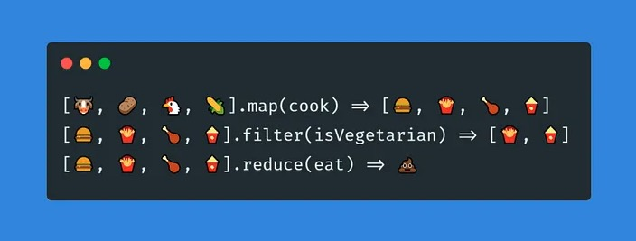

上文提到的参数"IDs=1,2,3,4,5"，需要把这个被逗号分割的字符串转换为int切片[]int{1,2,3,4,5}，用于后续代码的使用。<br>
解决思路：
```go
type UserMany struct {
    IDs string
}

func (req *UserMany) IDsValues() []int {
    ss := strings.Split(req.IDs, ",")
    var values []int
    for _, s := range ss {
        value, err := strconv.Atoi(s)
        if err != nil {
            continue
        }
        values = append(values, value)
    }
    return values
}
```
[源码链接](../chapter-param-complex-validator-1)<br>
代码分析：<br>
通过request.UserMany模型解析IDs字符串参数，问题显而易见，当另外一个接口也需要IDs参数时，相对应的request模型同样需要实现IDsValues函数，这样就导致的重复代码。

解决思路：
```go
type UserMany struct {
    IDs IDsField
}

type IDsField string

func (req *IDsField) Values() []int {
    ss := strings.Split(string(*req), ",")
    var values []int
    for _, s := range ss {
        value, err := strconv.Atoi(s)
        if err != nil {
            continue
        }
        values = append(values, value)
    }
    return values
}
```
代码分析：<br>
通过独立出来的IDsField，把解析过程封装其内部，当另外一个接口需要IDs参数时，重用即可；<br>
这种方式又带来另外一个问题，例如用户等级Level，当需要查询多个用户等级，就需要再复制粘贴LevelsField结构体，如下：
```go
type LevelsField string

func (req *LevelsField) Values() []int {
    ss := strings.Split(string(*req), ",")
    var values []int
    for _, s := range ss {
        value, err := strconv.Atoi(s)
        if err != nil {
            continue
        }
        values = append(values, value)
    }
    return values
}
```
我们把角度再拔高一点思维再抽象一点，根据字符串"1,2,3,4,5"的特征新建一个通用的IntsFieldV1结构体，如下：
```go
type UserMany struct {
    IDs    IntsFieldV1
    Levels IntsFieldV1
}

type IntsFieldV1 string

func (req *IntsFieldV1) Values() []int {
    ss := strings.Split(string(*req), ",")
    var values []int
    for _, s := range ss {
        value, err := strconv.Atoi(s)
        if err != nil {
            continue
        }
        values = append(values, value)
    }
    return values
}
```
这样，用户ID和用户等级等多整形数字参数就可以复用IntsFieldV1。

下面进入本文的重点，我们先审视一下IntsFieldV1.Values方法，Values方法的目的是把被逗号分割的string，转换为[]int，分为三步骤：<br>
步骤1：字符串Split为[]string<br>
步骤2：for循环[]string获取切片里的字符串<br>
步骤3：字符串转换为int，转换规则比较宽松，失败忽略，只收集可以转换成功的数据<br>

这十行代码看起来没什么问题，但莫名就有点糟心，给人一种乱糟糟的感觉，但又说不出哪里不对，我们接着往下看。

字符串"1,2,3,4,5"转换为[]int{1,2,3,4,5}有三种规则：<br>
1、只转换有效的数据<br>
2、无效数据报错，停止转换<br>
3、尽力而为，无效数据转换失败，默认零值<br>
字符串"1,s,2,,3"转换对应的结果：<br>
1、[]int{1,2,3}<br>
2、报错<br>
3、[]int{1,0,2,0,3}

对应实现的代码：
```go
// 只转换有效的数据
func (req *IntsFieldV1) Values() []int {
    ss := strings.Split(string(*req), ",")
    var values []int
    for _, s := range ss {
        value, err := strconv.Atoi(s)
        if err != nil {
            continue
        }
        values = append(values, value)
    }
    return values
}

// 无效数据报错，停止转换
func (req *IntsFieldV1) MustValues() ([]int, error) {
    ss := strings.Split(string(*req), ",")
    var values []int
    for _, s := range ss {
        value, err := strconv.Atoi(s)
        if err != nil {
            return nil, err
        }
        values = append(values, value)
    }
    return values, nil
}

// 尽力而为，无效数据转换失败，默认零值
func (req *IntsFieldV1) ShouldValues() []int {
    ss := strings.Split(string(*req), ",")
    var values []int
    for _, s := range ss {
        value, _ := strconv.Atoi(s)
        values = append(values, value)
    }
    return values
}
```
大家可以花五分钟审视一下这三个方法，思考一下有没有优化空间。

当Values、MustValues、ShouldValues放在一起对比，感觉更糟心了，代码大体一致，只有部分的微小区别，想抽出公共部分独立出来又特别难搞，导致这种局面的原因是什么呢？

我们分析一下Values方法中的for循环，短短的四五行用到了ss、s、values、value、err多个变量，格式转换、错误判断、循环停止判断、数据收集等功能揉杂在一起，就这是浆糊式代码。

for循环承载了太多的功能，需要给它减轻负担，Values方法的本意是只收集有效数据，优化思路就是先把无效数据过滤掉，然后只对有效数据进行格式转换，这样就避免了格式转换的同时还要进行数据有效性判断。

同理MustValues方法，我们也先进行数据有效性判断，出现无效数据直接返回错误。

我们来到了V2版本：
```
type IntsFieldV2 string
    
func (req *IntsFieldV2) Values() []int {
    ss := req.split()
    // 过滤出有效数据
    var ssFiltered []string
    for _, s := range ss {
        if numeral.IsInt(s) {
            ssFiltered = append(ssFiltered, s)
        }
    }
    
    var values []int
    for _, s := range ssFiltered {
        value, _ := strconv.Atoi(s)
        values = append(values, value)
    }
    return values
}
    
func (req *IntsFieldV2) MustValues() ([]int, error) {
    ss := req.split()
    // 预先进行有效性判断
    for _, s := range ss {
        if !numeral.IsInt(s) {
            return nil, errors.New(s + " is not an integer")
        }
    }
    
    var values []int
    for _, s := range ss {
        value, _ := strconv.Atoi(s)
        values = append(values, value)
    }
    return values, nil
}
```
numeral.IsInt函数是通过正则来判断字符串是否是int类型。

这样原本的for循环只是实现简单的数据格式转换功能，同时Values、MustValues、ShouldValues三个方法出现了相同代码块：
```go
var values []int
for _, s := range ss {
    value, _ := strconv.Atoi(s)
    values = append(values, value)
}
```
我们先把数据转换功能代码抽取出来，独立成一个方法，这样来到了V3版本：
```go
func (req *IntsFieldV3) toInt(s string) int {
    value, _ := strconv.Atoi(s)
    return value
}
```
虽然for循环抽取了toInt方法，但三个方法仍然存在着相同代码块：
```go
var values []int
for _, s := range ss {
    values = append(values, req.toInt(s))
}
```
这个for循环本质是[]string转换[]int的实现过程，一种类型转换成另外一种类型，在编程中有个专业术语：map映射，我们把映射过程抽取出来，这样来到了V4版本：
```go
func (req *IntsFieldV4) mapper(ss []string, fn func(s string) int) []int {
    var values []int
    for _, s := range ss {
        values = append(values, fn(s))
    }
    return values
}
```
很多编程语言中都自带map映射方法，python、js的map、java的stream.map、php的array_map，但是go语言没有实现，我们使用第三方库：pie [源码链接](https://github.com/elliotchance/pie)，这样来到了V5版本：
```go
pie.Map(ss, req.toInt)
```
toInt方法pie包里也自带，这样来到了V6版本：
```go
// 最终版本
return pie.Ints(ssFiltered)

// 版本二
//return pie.Map(ssFiltered, numeral.ToInt)

// 版本一
//return pie.Map(ssFiltered, func(s string) int {
//	return pie.Int(s)
//})
```
版本一：pie.Int是泛型函数，pie.Map不能直接使用，需要匿名函数封装一层；<br>
版本二：版本一不够优雅，由此封装成numeral.ToInt函数；<br>
最终版本：pie包自带[]string转换[]int的map函数pie.Ints，代码更简洁。<br>

Values方法的这段过滤功能的代码块可以使用pie.Filter代替
```go
var ssFiltered []string
for _, s := range ss {
    if numeral.IsInt(s) {
        ssFiltered = append(ssFiltered, s)
    }
}
```
同时MustValues中的这段判断数据有效性代码可以使用pie.All代替
```go
for _, s := range ss {
    if !numeral.IsInt(s) {
        return nil, errors.New(s + " is not an integer")
    }
}
```
这样来到了V7版本：
```go
// 过滤
pie.Filter(ss, numeral.IsInt)

// 判断有效性
if !pie.All(ss, numeral.IsInt) {
    return nil, errors.New("one of numbers is not an integer")
}
```
判断有效性还可以使用gin自带的validator包，需要把numeral.ToInt注册到validator包中：
```go
if err := validate.Var(ss, "dive,int"); err != nil {
    return nil, err
}
// dive标签功能很强大，请参照文档学习
```
我们再整理一下，省去一些中间变量，来到了最终版本：
```go
type IntsField string

func (req *IntsField) Values() []int {
    return pie.Ints(pie.Filter(req.split(), numeral.IsInt))
}

func (req *IntsField) MustValues() ([]int, error) {
    ss := req.split()
    if !pie.All(ss, numeral.IsInt) {
        return nil, errors.New("one of numbers is not an integer")
    }
    return pie.Ints(ss), nil
}

func (req *IntsField) ShouldValues() []int {
    return pie.Ints(req.split())
}

func (req *IntsField) split() []string {
    return strings.Split(string(*req), ",")
}
```
最终版本颇有一些函数式编程的味道，对比V1版本，希望对大家有所启发。

从V1版本迭代到最终版本，虽然代码不多，但涉及到的知识点挺多的，而且还非常重要，我们来详细分析。

### 关注点分离
关注点分离（Separation of Concerns，简称SoC）是软件工程中的一个设计原则，它鼓励将一个复杂的问题分解成多个更小的、更易于管理的部分。每个部分解决问题的一个特定方面，即一个“关注点”。通过这种方式，关注点分离旨在提高软件的可维护性、可扩展性和可复用性，同时减少代码的复杂度。

在我们不断迭代的过程中，关注点分离是最重要的指导思想，贯穿始终。

在V1版本Values方法中的for循环就存在过多的关注点：
```go
for _, s := range ss {               // 关注点1：for循环
    value, err := strconv.Atoi(s)    // 关注点2：格式转换
    if err != nil {                  // 关注点3：数据转换规则
        continue                     // 关注点4：循环停止
    }
    values = append(values, value)   // 关注点5：数据收集
}
```
通过分离关注点，拆成两个for循环，第一个for循环是过滤有效数据，第二个for循环是数据转换，两个for的职责就比较单一，代码的复杂度降低，可读性提高，来到了V2版本：
```go
for _, s := range ss {                      // 关注点1：for循环   
    if numeral.IsInt(s) {                   // 关注点2：过滤条件   
        ssFiltered = append(ssFiltered, s)  // 关注点3：数据收集
    }
}

for _, s := range ssFiltered {              // 关注点1：for循环
    value, _ := strconv.Atoi(s)             // 关注点2：格式转换 
    values = append(values, value)          // 关注点3：数据收集
}
```
### 分离控制逻辑与业务逻辑
控制逻辑与业务逻辑的知识点，请参看已故陈皓先生的文章： [编程的本质](https://time.geekbang.org/column/article/2751)

控制逻辑：for循环<br>
业务逻辑：格式转换

通过分离关注点，把业务逻辑格式转换功能提取成独立的方法达到代码重用的目的，这样来到了V3版本：
```go
for _, s := range ssFiltered {              // 关注点1：for循环
    values = append(values, req.toInt(s))   // 关注点2：数据收集
}
```
抽取控制逻辑，实现mapper方法，这样来到了V4版本：
```go
func (req *IntsFieldV4) mapper(ss []string, fn func(s string) int) []int {
    var values []int
    for _, s := range ss {
        values = append(values, fn(s))
    }
    return values
}
```
控制逻辑是可以标准化的，引入pie包中的Map函数，代替我们自己的mapper方法，这样来到了V5版本：
```go
pie.Map(ss, req.toInt)
```
简单的业务逻辑也是可以标准化的，例如string to int，[]string to int[]等等，来到了V6版本：
```go
pie.Ints(ss)
```
控制逻辑中的过滤操作和迭代判定操作也是可以标准化的，这样来到了V7版本：
```go
pie.Filter(ss, numeral.IsInt)

if !pie.All(ss, numeral.IsInt) {
    return nil, errors.New("one of numbers is not an integer")
}
```
整理一下来到了最终版本：
```go
func (req *IntsField) Values() []int {
    return pie.Ints(pie.Filter(req.split(), numeral.IsInt))
}

func (req *IntsField) MustValues() ([]int, error) {
    ss := req.split()
    if !pie.All(ss, numeral.IsInt) {
        return nil, errors.New("one of numbers is not an integer")
    }
    return pie.Ints(ss), nil
}

func (req *IntsField) ShouldValues() []int {
    return pie.Ints(req.split())
}
```
对于Values方法，真正的关注点是过滤条件这块业务逻辑，剩下的都可以标准化；

对于MustValues方法，真正的关注点是数据有效性判定这块业务逻辑，剩下的都可以标准化；

对于ShouldValues方法，关注点就只能是如何标准化了...

标准化就意味着高效，不仅仅是编程，各行各业亦是如此。

pie包就是各种控制逻辑标准化实现，也有一些简单数据映射map函数，同样go自带slices包也实现了一些标准化，建议大家把pie和slices包中的每个函数都学习一遍，对照自己过往的业务代码，思考在什么场景下可以应用。

程序开发大多数情况下都在倒腾数据，能熟练的倒腾数据也是人类高质量程序员的判定标准。



Sort:ID
Order:ASC
Offset:20
Limit:10
Amount:100,1000
Level:10,50
Status:normal,cancel,invalid
CreateTime:2024-01-01 00:00:00,2024-05-01 23:59:59
UpdateTime:2024-02-01,2024-06-01
StartTime:2024-03-01,2024-07-01 23:59:59
Filter:{"ID":1,"Nickname":"admin","Amount":"100,1000","Level":"10,50","Status":"normal,cancel,invalid","CreateTime":"2024-01-01 00:00:00,2024-05-01 23:59:59","UpdateTime":"2024-02-01,2024-06-01","StartTime":"2024-03-01,2024-07-01 23:59:59"}

