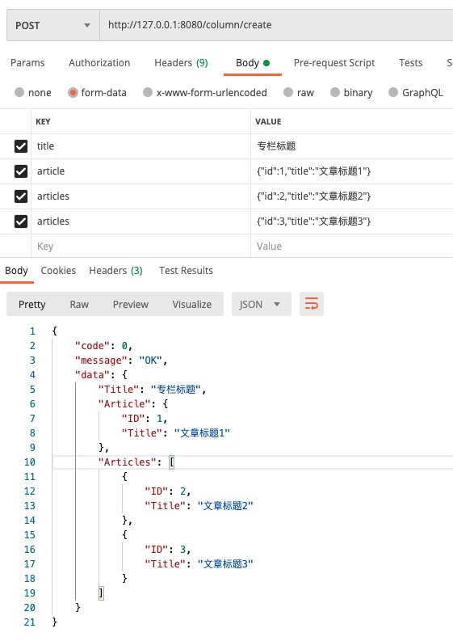

web开发中，你肯定见到过各种各样的表单或接口数据校验：
- 客户端参数校验：在数据提交到服务器之前，发生在浏览器端或者app应用端，相比服务器端校验，用户体验更好，能实时反馈用户的输入校验结果。

- 服务器端参数校验：发生在客户端提交数据并被服务器端程序接收之后，通常服务器端校验都是发生在将数据写入数据库之前，如果数据没通过校验，则会直接从服务器端返回错误消息，并且告诉客户端发生错误的具体位置和原因，服务器端校验不像客户端校验那样有好的用户体验，因为它直到整个表单都提交后才能返回错误信息。但是服务器端校验是应用对抗错误，恶意数据的最后防线，在这之后，数据将被持久化至数据库。当今所有的服务端框架都提供了数据校验与过滤功能（让数据更安全）。

本文主要讨论服务器端参数校验。

确保用户以正确格式输入数据，提交的数据能使后端应用程序正常工作，同时在一切用户的输入都是不可信的前提下（SQL注入，XSS等漏洞），
参数验证是不可或缺的一环，也是很繁琐效率不高的一环，在对接表单提交或者api接口数据提交，程序里充斥着大量重复验证逻辑和if return语句，本文分析参数校验的三种方式，找出最优解，从而提高参数验证程序代码的开发效率。


#### 案例：
如上图为常见的网站登陆场景，用户第一步输入手机号，点击获取短信验证码；
第二步填入手机收到的短信验证码，点击登录按钮完成登录。<br>
需要实现两个接口：
```
发送验证码接口：
参数校验需求：判断手机号非空，手机号格式是否正确
登录接口：
参数校验需求：1、判断手机号非空，手机号格式是否正确；2、验证码非空，验证码格式是否正确
```

#### 第一种实现方式：自定义实现校验逻辑
```go
// controller.Sms
func (ctr *Sms) Captcha(c *gin.Context) {
    mobile := c.DefaultQuery("mobile", "")
    
    if mobile == "" {
        c.AbortWithStatusJSON(http.StatusOK, gin.H{"error": "手机号不能为空"})
        return
    }
    
    if matched, _ := regexp.MatchString(`^(1[3-9][0-9]\d{8})$`, mobile); !matched {
        c.AbortWithStatusJSON(http.StatusOK, gin.H{"error": "手机号格式不正确"})
        return
    }
    
    c.JSON(http.StatusOK, gin.H{
        "mobile": mobile,
    })
}

// controller.User
func (ctr *User) Login(c *gin.Context) {
    mobile := c.DefaultQuery("mobile", "")
    captcha := c.DefaultQuery("captcha", "")
    
    if mobile == "" {
        c.AbortWithStatusJSON(http.StatusOK, gin.H{"error": "手机号不能为空"})
        return
    }
    
    if matched, _ := regexp.MatchString(`^(1[3-9][0-9]\d{8})$`, mobile); !matched {
        c.AbortWithStatusJSON(http.StatusOK, gin.H{"error": "手机号格式不正确"})
        return
    }
    
    if captcha == "" {
        c.AbortWithStatusJSON(http.StatusOK, gin.H{"error": "验证码不能为空"})
        return
    }
    
    if len(captcha) != 4 {
        c.AbortWithStatusJSON(http.StatusOK, gin.H{"error": "验证码必须4位"})
        return
    }
    
    c.JSON(http.StatusOK, gin.H{
        "mobile":  mobile,
        "captcha": captcha,
    })
}
```
[源码链接](../chapter-param-validate-1)

代码分析：<br>
参数校验代码放在Controller层；<br>
这是一种比较朴素的实现方式，在现实评审中经常遇到，这样实现会有什么问题？<br>
1、手机号码校验和验证码校验逻辑不能重用，会导致多处重复代码；<br>
2、违背了controller层的职责，controller层充斥着大量的验证函数（Controller层职责：从HTTP请求中获得信息，提取参数，并分发给不同的处理服务）；

> **重复代码是软件质量下降的最重要的原因！！！**

1、重复代码会造成维护成本的成倍增加；<br>
2、需求的变动导致需要修改重复代码，如果遗漏某处重复的逻辑，就会产生bug（例如手机号码增加12开头的验证规则）；<br>
3、重复代码会导致项目代码体积变得臃肿；

聪明的开发者肯定第一时间想到解决办法：提取出验证逻辑，例如工具包util实现IsMobile函数
```
package util

func IsMobile(mobile string) bool {
   matched, _ := regexp.MatchString(`^(1[3-9][0-9]\d{8})$`, mobile)
   return matched
}

代码分析：
问题：代码会大量出现util.IsMobile、util.IsEmail等校验代码
```
> 思考：从面向对象的思想出发，IsMobile属于util的动作或行为吗？（先思考，后文会详细探讨）

#### 第二种实现方式：模型绑定校验
模型绑定校验是目前参数校验最主流的验证方式，每个编程语言的web框架基本都支持这种模式，模型绑定时将Http请求中的数据映射到模型对应的属性，参数可以是简单类型，如整形，字符串等，也可以是复杂类型，如Json，Json数组，对各种数据类型进行验证，然后抛出相应的错误信息。
```go
// request.SmsCaptcha
type SmsCaptcha struct {
    Mobile string `form:"mobile" binding:"required,number,mobile"` // 重复代码
}

// request.UserLogin
type UserLogin struct {
    Mobile  string `form:"mobile" binding:"required,number,mobile"` // 重复代码
    Captcha string `form:"captcha" binding:"required,number,len=4"`
}


// controller.Sms
func (ctr *Sms) Captcha(c *gin.Context) {
    request := new(request.SmsCaptcha)
    if err := c.ShouldBind(request); err != nil {
        c.AbortWithStatusJSON(http.StatusOK, gin.H{"error": err.Error()})
        return
    }
    
    c.JSON(http.StatusOK, gin.H{
        "request": request,
    })
}


// controller.User
func (ctr *User) Login(c *gin.Context) {
    request := new(request.UserLogin)
    if err := c.ShouldBind(request); err != nil {
        c.AbortWithStatusJSON(http.StatusOK, gin.H{"error": err.Error()})
        return
    }
    
    c.JSON(http.StatusOK, gin.H{
        "request": request,
    })
}
```
代码分析：<br>
1、比上文中的校验方式要简洁很多<br>
2、mobile校验配置重复（如果要修改校验规则，需要修改两个地方的代码）<br>
[源码链接](../chapter-param-validate-2)

再介绍第三种参数校验方式之前，我们先对项目做几点优化，使得代码更接近我们日常开发的需求。

1、优化struct属性中的form标签：
```go
type SmsCaptcha struct {
    Mobile string `form:"mobile" binding:"required,number,mobile"` 
}

type UserLogin struct {
    Mobile  string `form:"mobile" binding:"required,number,mobile"`
    Captcha string `form:"captcha" binding:"required,number,len=4"`
}
```
form标签目的是为了绑定指定名称的from表单参数，通常是struct结构体属性名称首字母小写，这里也属于变相的重复代码，当我们通过复制这一行代码新建一个新的属性的时候，就需要改两个地方，实际开发过程中笔者真的发生过几次把form标签漏改的情况，导致bug耽误了时间，这种bug还特别让人恼火。

所以为了一劳永逸，我们直接把from标签干掉，默认的struct结构体属性名称做为参数名称，省时又方便，下文中就会采用这种格式，当然习惯了首字母小写的同学感觉特别别扭，请克服心理障碍，可以参考阿里的接口文档：[链接](https://help.aliyun.com/document_detail/472990.html)，请求参数返回参数都是首字母大写的格式，希望可以帮助你打败习惯的心魔。

2、统一输出格式
通过controller.Wrapper函数消除这种结构重复，并统一了数据输出格式。<br>
[源码链接](../chapter-param-validate-3)

#### 第三种实现方式：拆解模型字段，组合结构体
解决字段校验配置重复的解决办法是拆解字段为独立结构体，通过多个字段结构体的相互组合成业务所需的结构体；
```
type MobileField struct {
    Mobile string `binding:"required,number,mobile"`
}

type CaptchaField struct {
    Captcha string `binding:"required,number,len=4"`
}

type IDField struct {
    ID int `binding:"required,min=1"`
}

type CaptchaSend struct {
    MobileField
}

type UserLogin struct {
    MobileField
    CaptchaField
}

type UserRegister struct {
    MobileField
    CaptchaField
    user.NicknameField
    user.PasswordField
    user.RePasswordField
}
```
代码分析：<br>
1、独立的字段结构体通常以表名为包名定义范围，比如商品名称和用户名称字段名都为Name，但是所需定义的校验逻辑（字符长度等）很有可能不同；<br>
2、复用Mobile、Captcha、ID、CreateTime等公共字段结构体；<br>


这种方式带来一个问题，跨字段校验规则不生效，如下，用户注册时，需要对密码和重复密码字段校验是否相等
```go
type PasswordField struct {
    Password string `binding:"required,min=6"`
}

type RePasswordField struct {
	RePassword string `binding:"eqfield=Password"`
}
// eqfield不起作用
```
解决方式：<br>
```go
type UserRegister struct {
    MobileField
    CaptchaField
    user.NicknameField
    user.PasswordField
    RePassword string `binding:"eqfield=Password"`
}
```
[源码链接](../chapter-param-validate-4)

总结：<br>
一、验证逻辑封装在各自的实体中，由request层实体负责验证逻辑，验证逻辑不会散落在项目代码的各个地方，当验证逻辑改变时，修改对应的实体就可以了，这就是代码的高内聚；

二、通过不同实体的嵌套组合就可以实现多样的验证需求，提高了代码的复用率，这就是代码的可重用性

独立字段结构体组合成不同的校验结构体，这种方式在实际项目开发中有很大的灵活性，可以满足参数校验比较多变复杂的需求场景，小伙伴可以在项目开发中慢慢体会。

参数验证失败的错误提示汉化：<br>
参数校验的英文提示理论上用户是看不到的，因为前端也需要检验用户输入，用户看到的是前端代码实现的提示信息，后端的校验提示主要是给对接接口的程序员看的，转换为中文意义不大，建议是不要转，无端增加工作量，供大家参考。


#### 补充几个小知识点
1、需要提交参数为json或json数组如何校验绑定？参照下图接口代码<br>


2、严格遵循一个接口对应一个校验结构体
```go
func (ctr *Column) One(c *gin.Context) {
    request := new(request.IDField)
    if err := c.Validate(request); err != nil {
        return nil, err
    }

    return request, nil
}
```
示例代码获取文章专栏详情的接口，参数为专栏id，因为只有一个id参数，
如果刚开始图省事，没有建立对应独立的ColumnOne校验结构体，后期接口增加参数（例如来源等），还是要改动这一块代码，增加代码的不确定性

3、布尔参数的三种状态
```go
type ColumnOne struct {
    IDField
    // 为真显示重点文章，为否显示非重点文章，为nil都显示
	Important *bool
}

column?ID=1&Important=true    Important为true
column?ID=1&Important=false   Important为false
column?ID=1                   Important为nil
```

开发中会有提交多个ID对数据库做某些操作，例如删除用户，参数是"IDS=1,2,3,4,5"，那么我们又要如何优雅的应对呢，请看下文分解。